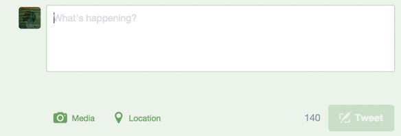

</img>

# Be More Original

BeMoreOriginal is a browser extension that stops you from posting
unoriginal tweets. While you type a tweet, it searches Twitter for
tweets with identical text. If it finds any, it prohibits you from
posting your tweet by disabling the "Tweet" button. BeMoreOriginal
forces you to be altruistic and contribute to humanity's collective
expression by coming up with an original idea instead of appropriating
one that already exists.

### License

MIT
